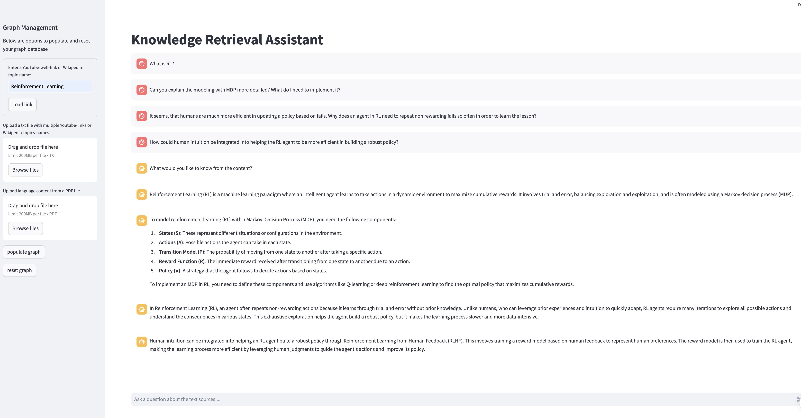

# Graph RAG Application for Efficient Knowledge Retrieval from User-Defined Sources

  

## Introduction

Welcome to the Graph RAG Application! This innovative tool allows you to extract and interact with knowledge from various text data sources. Utilizing state-of-the-art technologies like Langchain, Neo4J, OpenAI, and the RAGAS toolbox for performance evaluation, this app provides a seamless way to build and query a knowledge graph.

## Project Structure

	├── src
	│   ├── __init__.py
	│   ├── app.py
	│   ├── config.py
	│   ├── config.yaml
	│   └── entities.py
	│   └── .graph.py
	│   └── .rag.py
	├── tests
	│   ├── (not yet implemented)
	├── docs
	│   └── README.md
	├── .gitignore
	├── LICENSE
	├── requirements.txt
	└── setup.py
	├── data
	│   ├── (add your data here)
	├── images
	│   ├── frontend_image.png
	├── eval
	│   ├── (still to implement evaluation and hyperparameter optimization)

### Key Features
- Versatile Input Sources: Add text data via PDF file uploads, YouTube links (transcripts), or Wikipedia article names.
- Knowledge Graph Construction: Automatically build a comprehensive knowledge graph from extracted entities.
- Hybrid Retrieval Approach: Combine vector nearest neighbor and cipher queries for efficient content retrieval.
- Interactive Interface: Chat with the knowledge graph through a user-friendly Streamlit interface.

## Prerequisites

Before running the application, ensure you have the following:
- A running Neo4J instance within a Docker container.
- The Python application managing graph construction and querying via LLMs.

## Setup and Installation

### Dependencies
Install the required dependencies specified in `requirements.txt`:

pip install -r requirements.txt
# or
poetry install

### Configuration

#### OpenAI Authentication
Obtain an API key from the OpenAI website for communicating with the LLMs. Place this key in a `.env` file within the application directory:

openaiAPI=<Your_OpenAI_API_Key>

#### Neo4J Docker Setup
1. Download the APOC JAR file to your `$USER/plugins` directory.
2. Run the following Docker command (assuming Docker Desktop is installed):

docker run \
  -v ${PWD}/data:/data -v ${PWD}/plugins:/plugins \
  --publish=7474:7474 --publish=7687:7687 \
  --name neo4j-v5-apoc \
  --env NEO4J_AUTH=none \
  -e NEO4J_PLUGINS='["apoc"]' \
  -e NEO4J_dbms_security_procedures_unrestricted="apoc.*" \
  neo4j:5.22.0

### Execution
Navigate to the URL exposed by the Neo4J container, set the password, and ensure the app has this before starting it up.

## Running the App
Execute the following command:

streamlit run graph_rag/app.py

## Setup the Knowledge Graph

The first time you run the app, you'll need to build the graph. Follow these steps:

1. Enter Sources: Provide YouTube links, Wikipedia articles, or upload PDF files. You can also upload a text file with a list of links.
2. Populate Graph: Press the "Populate Graph" button. This process may take a few minutes and will result in a fully formed graph that you can visualize in Neo4j.

Once the graph is built, you can chat with the LLM, which leverages the graph-based knowledge base.

### Resetting the Graph
Use the "Reset Graph" button to remove all nodes, edges, and metadata, allowing you to start fresh.

## Conclusion

The Graph RAG Application is a powerful tool for knowledge retrieval and interaction. Its flexible input options, robust graph construction, and intuitive interface make it a valuable resource for efficiently managing and querying large text data sets.
